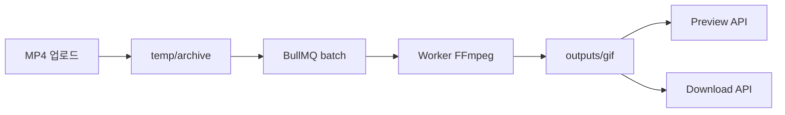

# E2E 변환 테스트 (Upload → Queue → FFmpeg → GIF → Preview → Download)

전체 파이프라인을 한 번에 검증하는 스크립트입니다. 기존 업로드 경로·BullMQ 큐·FFmpeg 파이프라인·`outputs/gif/`·미리보기/다운로드 API를 그대로 사용합니다.

## 사전 준비

```bash
cd motiondot
npm install
npm run ensure-dirs
```

### Redis + Worker (필수)

큐 모드 E2E는 Worker가 `export_queue`(또는 `motiondot-convert`)를 처리해야 합니다.

```bash
# 터미널 1
redis-server

# 터미널 2
npm run worker
```

## 1) 통합 모드 (권장) — HTTP 서버 불필요

업로드는 `temp/archive/`에 저장하고, `enqueueBatchConvertJobs`로 큐에 넣은 뒤 진행률을 폴링합니다.

```bash
npm run test:e2e
```

### 샘플 MP4 지정

인자 없으면 FFmpeg로 3초짜리 640×360 테스트 MP4를 생성합니다.

```bash
npm run test:e2e -- /path/to/your-sample.mp4
```

환경 변수:

| 변수 | 기본값 | 설명 |
|------|--------|------|
| `TEST_PRESET_ID` | `tiktok-short-clip` | 프리셋 JSON id |
| `E2E_POLL_MS` | `1500` | 진행률 폴링 간격(ms) |
| `E2E_POLL_MAX` | `180` | 최대 폴링 횟수 |

성공 시 출력 예:

```
결과 GIF: .../motiondot/outputs/gif/<jobId>.gif
```

변환 로그: `temp/logs/<jobId>.log`

## 2) HTTP API 모드 — `npm run dev` 필요

```bash
# 터미널 3
npm run dev
```

```bash
npm run test:e2e:api
npm run test:e2e:api -- ./my-ad.mp4
```

`MOTIONDOT_BASE_URL`으로 호스트 변경 가능 (기본 `http://127.0.0.1:3000`).

검증 단계:

1. `POST /api/upload` — MP4 업로드
2. `POST /api/jobs/batch` — GIF job 큐 등록
3. Worker — FFmpeg 변환 → `outputs/gif/<jobId>.gif`
4. `GET /api/jobs/batch/progress` — 진행률·에러 로그
5. `GET /api/preview/media?path=<절대경로>` — GIF 미리보기
6. `GET /api/export/download?file=<jobId>.gif&format=gif` — 다운로드

## 파이프라인 흐름



## 문제 해결

| 증상 | 확인 |
|------|------|
| Redis 연결 실패 | `redis-server` 실행, `REDIS_HOST` / `REDIS_PORT` |
| 타임아웃 | `npm run worker` 실행 여부 |
| `failed` | `temp/logs/<jobId>.log`, 스크립트 stderr |
| API 모드 404 | `npm run dev` 및 `MOTIONDOT_BASE_URL` |

## 관련 스크립트

- `npm run test:convert` — Redis 없이 FFmpeg 직접 변환
- `npm run test:convert:queue` — 큐만 (GIF+WebP, preview/download 미검증)
